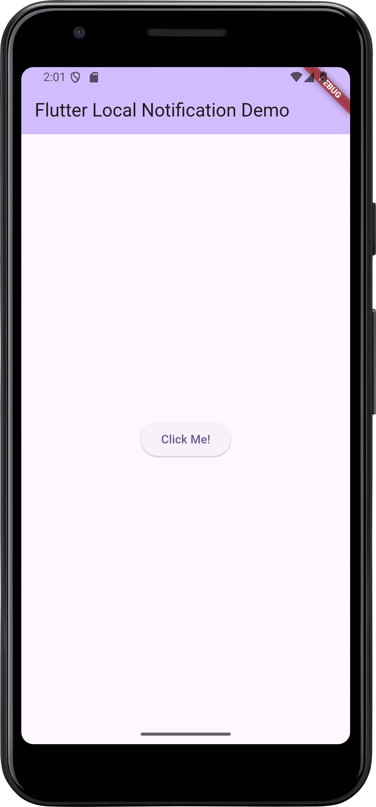
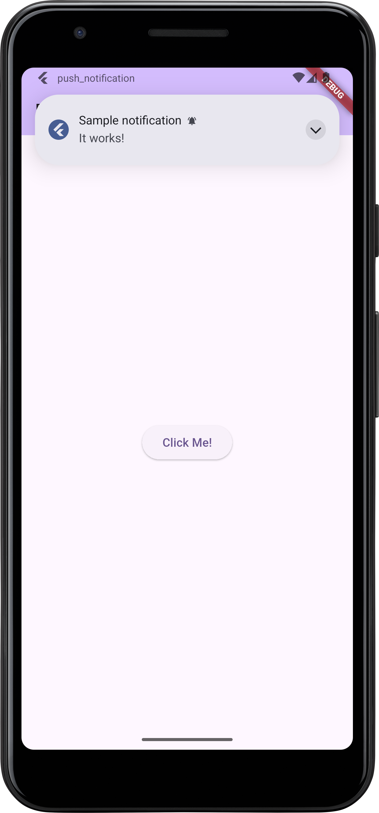
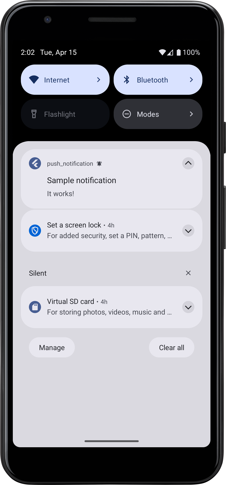

# push_notification

A Flutter project that demonstrate the usage of `flutter_local_notifications`.

## Introduction
This project is a simple Flutter application that demonstrates how to use the `flutter_local_notifications` package to display local notifications. The app includes features such as scheduling notifications, displaying notifications with different priorities, and handling notification taps.

The app is designed to be a starting point for developers who want to learn how to implement local notifications in their Flutter applications.
Here are some of the key features of the app:
- [flutter_local_notifications v.19.1.0](https://pub.dev/packages/flutter_local_notifications#-android-setup)

## Getting Started
To get started with the project, follow these steps:
- Clone the repository to your local machine. 
- You need to install Android SDK (at least SDK v.23) and Flutter SDK. Follow the instructions on the official [Flutter installation page](https://flutter.dev/docs/get-started/install). 
- Open the project in your preferred IDE (e.g., Android Studio, Visual Studio Code). 
- Run the app on an emulator or physical device. 
- Install dependencies by running this command in the terminal.
```bash
flutter pub get
```
- Run the app using the following command:
```bash
flutter run
```

## Important Note
We have several important notes regarding the usage of the `flutter_local_notifications` package:
- The minimum `ndkVersion` required for `flutter_local_notifications` is `27.0.12077973`. You can set this in your `android/build.gradle` file:
```gradle
android {
    ...
    defaultConfig {
        ...
        ndkVersion "27.0.12077973"
    }
}
```
- According to the [flutter_local_notifications documentation](https://pub.dev/packages/flutter_local_notifications#-android-setup), you need to set the several configurations  in your `main/AndroidManifest.xml` file:
```xml
<manifest xmlns:android="http://schemas.android.com/apk/res/android">
    <uses-permission android:name="android.permission.RECEIVE_BOOT_COMPLETED"/>
    <uses-permission android:name="android.permission.SCHEDULE_EXACT_ALARM" />
    <uses-permission android:name="android.permission.USE_EXACT_ALARM" />
    <uses-permission android:name="android.permission.USE_FULL_SCREEN_INTENT" />
    <uses-permission android:name="android.permission.POST_NOTIFICATIONS"/>

    <application
        android:label="push_notification"
        android:name="${applicationName}"
        android:icon="@mipmap/ic_launcher">
        ...
        
        <receiver android:name="com.dexterous.flutterlocalnotifications.ScheduledNotificationReceiver" />
        <receiver android:name="com.dexterous.flutterlocalnotifications.ActionBroadcastReceiver" />
        <service android:name="com.dexterous.flutterlocalnotifications.FlutterLocalNotificationsPlugin" android:exported="false"/>
        
        ...
    </application>
</manifest>
```
- Two important dependencies are required for the `flutter_local_notifications` package to work properly:
  - `flutter_local_notifications: ^19.1.0` (for local notifications)
  - `permission_handler: ^12.0.0+1` (for handling permissions)

## [notification_service.dart](lib/notification_service.dart)
This file contains the `NotificationService` class, which is responsible for managing local notifications. The class includes methods for initializing notifications, displaying notifications, and handling notification taps. It also includes methods for scheduling notifications and displaying notifications with different priorities.

We highlight this class because it is the core of the app and contains all the logic for managing notifications. The class uses the `flutter_local_notifications` package to create and display notifications, and it handles user interactions with notifications.

We keep the `NotificationService` class as a singleton to ensure that only one instance of the class is created throughout the app. This is done using the following code:
```dart
NotificationService._internal();

static final NotificationService _instance = NotificationService._internal();

factory NotificationService() => _instance;
```

The `init` method is called to initialize the notification settings and request permissions from the user. The method uses the `PermissionHandler` package to check and request permissions for displaying notifications. It also initializes the `FlutterLocalNotificationsPlugin` and sets up the notification channels for Android.
```dart
Future<void> init() async {
  AndroidInitializationSettings initializationSettingsAndroid =
      const AndroidInitializationSettings('@mipmap/ic_launcher');

  var initializationSettingsIOS = const DarwinInitializationSettings();

  var initializationSettings = InitializationSettings(
    android: initializationSettingsAndroid,
    iOS: initializationSettingsIOS,
  );

  await flutterLocalNotificationsPlugin.initialize(
    initializationSettings,
    onDidReceiveNotificationResponse: (NotificationResponse response) async {
      print('Notification tapped: ${response.payload}');
    },
  );

  if (await Permission.notification.isDenied) {
    await Permission.notification.request();
  }
}
```

The `showNotification` method is used to display a notification with a specified title, body, and payload. The method uses the `flutterLocalNotificationsPlugin` to create and display the notification. It also includes options for setting the priority and visibility of the notification.
```dart
Future showNotification({
    required String title,
    required String body,
    String? payload,
  }) async {
  var androidPlatformChannelSpecifics = const AndroidNotificationDetails(
    'channelId',
    'channelName',
    channelDescription: 'your_channel_description',
    importance: Importance.max,
    priority: Priority.high,
    showWhen: false,
  );

  var iOSPlatformChannelSpecifics = const DarwinNotificationDetails();

  var platformChannelSpecifics = NotificationDetails(
    android: androidPlatformChannelSpecifics,
    iOS: iOSPlatformChannelSpecifics,
  );

  await flutterLocalNotificationsPlugin.show(
    0,
    title,
    body,
    platformChannelSpecifics,
    payload: payload,
  );
}
```

The setup above is applied for both Android and iOS platforms. The `AndroidNotificationDetails` class is used to set the notification channel ID, name, and description. The `DarwinNotificationDetails` class is used for iOS-specific settings.

In [main.dart](lib/main.dart), we create an instance of the `NotificationService` class and call the `init` method to initialize the notification settings. We also include a button to trigger the `showNotification` method when pressed.
```dart
import 'package:flutter/material.dart';
import 'package:push_notification/service/notification_service.dart';

void main() async {
  WidgetsFlutterBinding.ensureInitialized();  // Ensure that the binding is initialized before calling any async methods
  await NotificationService().init(); // Initialize the notification service
  runApp(const MyApp());
}
```

We call `NotificationService().showNotification` to display a notification when the button is pressed. The notification includes a title, body, and payload. The payload can be used to pass additional data to the notification tap handler.
```dart
ElevatedButton(
  onPressed: () {
    NotificationService().showNotification(
      title: 'Hello',
      body: 'This is a local notification',
      payload: 'Notification Payload',
    );
  },
  child: const Text('Show Notification'),
),
```

## Conclusion
This project serves as a simple demonstration of how to use the `flutter_local_notifications` package to display local notifications in a Flutter application. The `NotificationService` class encapsulates the logic for managing notifications, and the app provides a user interface for triggering notifications. Here are some example images of the app in action,

You will see the following app after running the project:



When you click the "Show Notification" button, a notification will appear in the notification tray:




When you tap the notification, it will print the payload in the console:
```
I/flutter ( 6843): Notification tapped: 
D/InsetsController( 6843): hide(ime(), fromIme=false)
I/ImeTracker( 6843): com.ahmadtheswe.push_notification:da74e3be: onCancelled at PHASE_CLIENT_ALREADY_HIDDEN
E/libEGL  ( 6843): called unimplemented OpenGL ES API
```

## Scheduled Notifications

To setup scheduled notifications, you need to add the `timezone` package to your `pubspec.yaml` file in the dependencies section. This package is required for handling time zones and scheduling notifications at specific times:
```yaml
dependencies:
  timezone: ^0.10.0
```

Install the package by running the following command:
```bash
flutter pub get
```

After adding the `timezone` package, you need to initialize the time zone database. You can do this by calling the `initializeTimeZones` method in the `init` method of the `NotificationService` class:
```dart
...
import 'package:timezone/data/latest.dart' as tz;
import 'package:timezone/timezone.dart' as tz;

Future<void> init() async {
  tz.initializeTimeZones();
  ...
}
```

To schedule a notification, you can use the `scheduleNotification` method in the `NotificationService` class. This method allows you to specify the date and time for the notification to be triggered. The following code demonstrates how to schedule a notification:
```dart
Future<void> scheduleNotification({
  required String title,
  required String body,
  required DateTime scheduledTime,
  String? payload,
}) async {
  var androidPlatformChannelSpecifics = const AndroidNotificationDetails(
    'scheduled_channel_id',
    'Scheduled Notifications',
    channelDescription: 'Channel for scheduled notifications',
    importance: Importance.max,
    priority: Priority.high,
  );

  var iOSPlatformChannelSpecifics = const DarwinNotificationDetails();

  var platformChannelSpecifics = NotificationDetails(
    android: androidPlatformChannelSpecifics,
    iOS: iOSPlatformChannelSpecifics,
  );

  await flutterLocalNotificationsPlugin.zonedSchedule(
    1,
    title,
    body,
    tz.TZDateTime.from(scheduledTime, tz.local),
    platformChannelSpecifics,
    androidScheduleMode: AndroidScheduleMode.exactAllowWhileIdle,
    matchDateTimeComponents: DateTimeComponents.time, // Optional
    payload: payload,
  );
}
```

This is the example of how to use the `scheduleNotification` method in [main.dart](lib/main.dart):
```dart
ElevatedButton(onPressed: () {
  final now = DateTime.now();
  final scheduledTime = now.add(Duration(seconds: 20));
  NotificationService().scheduleNotification(title: 'Sample notification', body: 'It works!', scheduledTime: scheduledTime);
}, child: Column(
  children: [
    Text('Scheduled Notification'),
  ],
))
```

You can change the `scheduledTime` to any future date and time. The notification will be triggered at the specified time from line `final scheduledTime = now.add(Duration(seconds: 20));`. 